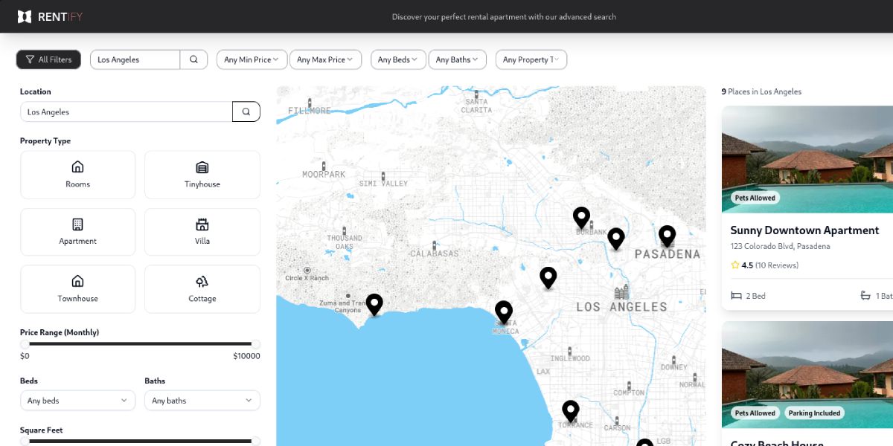

# Real Estate Platform

A modern real estate management platform that connects property managers with potential tenants, built with a Next.js frontend and Express backend.



## Overview

This application provides a dual-interface system where property managers can list and manage rental properties while tenants can browse, favorite, and apply for available properties. The platform includes features like property searching with filtering options, application management, lease agreements, and geospatial searching.

## Features

- **Property Management**: Create, view, and manage rental properties
- **Role-Based Access**: Separate interfaces for property managers and tenants
- **Property Search**: Filter properties by price, beds, baths, amenities, etc.
- **Geospatial Search**: Find properties by location using PostGIS
- **Application System**: Submit and review rental applications
- **Lease Management**: Track and manage lease agreements and payments
- **Image Uploads**: Store property photos in AWS S3
- **Authentication**: Secure user authentication with AWS Cognito

## Tech Stack

### Frontend

- Next.js 15 (with App Router)
- React 19
- TypeScript
- Redux Toolkit (with RTK Query)
- Tailwind CSS
- Shadcn UI components
- AWS Amplify (for authentication)
- Mapbox GL (for maps)

### Backend

- Express.js
- TypeScript
- Prisma ORM
- PostgreSQL (with PostGIS extension)
- AWS S3 (for file storage)
- JWT (for API authentication)

## Project Structure

### Client

- `/src/app`: Next.js app router pages and layouts
- `/src/components`: Reusable UI components
- `/src/types`: TypeScript type definitions
- `/src/state`: Redux store configuration and API slices
- `/src/lib`: Utility functions and shared resources
- `/src/hooks`: Custom React hooks

### Server

- `/src/controllers`: Request handlers for API endpoints
- `/src/routes`: Express route definitions
- `/src/middleware`: Authentication and validation middleware
- `/src/lib`: Utility functions and constants
- `/prisma`: Database schema, migrations, and seed data

## Database Models

- **Property**: Rental properties with details, photos, amenities
- **Manager**: Property managers who list and manage properties
- **Tenant**: Users who browse and apply for properties
- **Location**: Geographical data with PostGIS integration
- **Application**: Rental applications submitted by tenants
- **Lease**: Agreements between managers and tenants
- **Payment**: Rent payment tracking

## Getting Started

### Prerequisites

- Node.js v22+
- PostgreSQL with PostGIS extension
- AWS account (for S3 and Cognito)

### Installation

1. Clone the repository

```bash
git clone https://github.com/douglasedward/real-estate.git
cd real-estate
```

2. Install dependencies

```bash
# Install client dependencies
cd client
npm install

# Install server dependencies
cd ../server
npm install
```

3. Set up environment variables

   - Create `.env` files in both client and server directories
   - Configure database connection, AWS credentials, and API endpoints

4. Set up the database

```bash
cd server
# Start PostgreSQL
docker compose up -d
# Generate Prisma client
npm run prisma:generate
# Run migrations
npx prisma migrate dev --name init
# Seed initial data
npm run seed
```

5. Start development servers

```bash
# Start server
cd server
npm run dev

# Start client
cd client
npm run dev
```

## API Endpoints

- `GET /properties`: List all properties with optional filters
- `GET /properties/:id`: Get details of a specific property
- `POST /properties`: Create a new property (manager only)
- `GET /applications`: List applications (filtered by tenant/manager)
- `POST /applications`: Submit a new application (tenant only)
- `POST /applications/:id/status`: Update status for a specific application (manager only)
- `GET /leases`: List lease agreements
- `GET /leases/:id/payments`: Get payments for a specific lease

## License

[MIT License](LICENSE)
